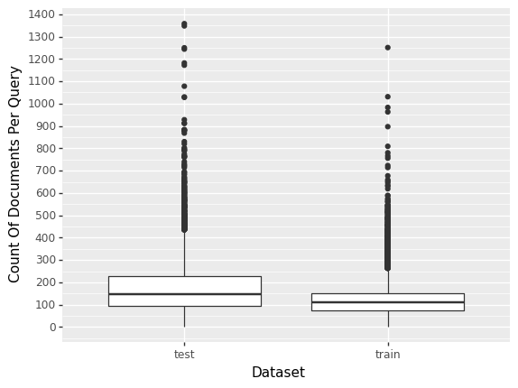

# Summary

This repo builds a boosted model focused on ranking with LightGPM on the
Microsoft’s Web30K dataset. Gain is directly optimized during model
training. At the top 10 scores, gain is .571 on unseen data. This is
considerably higher than the publication this code is based on
indicating improvements in source code after printing.

For compute speed, I used the [Polars data frame
library](https://www.pola.rs) and GPU training.

# Data Overview

### Queries and Documents

Learning to rank (L.T.R.) machine learning has its origin in search
engine optimization. Because of this, there are two key ideas: documents
and queries. A document is a web page. The page is crawled and features
are created. Example features include covered query term number, term
frequency, and stream length. A query is the string the user types into
Bing. There is a many-to-many relationship between documents and
queries. The web surfer sees many web pages per search, and a document
may show up in many queries. The label for a document depends on the
query it is in.

Each row in training is a document. The first five rows look like

    shape: (5, 98)
    ┌───────┬─────┬─────┬─────┬─────┬──────┬──────┬──────┬──────┐
    │ label ┆ qid ┆ F1  ┆ F2  ┆ ... ┆ F133 ┆ F134 ┆ F135 ┆ F136 │
    │ ---   ┆ --- ┆ --- ┆ --- ┆     ┆ ---  ┆ ---  ┆ ---  ┆ ---  │
    │ f64   ┆ f64 ┆ f64 ┆ f64 ┆     ┆ f64  ┆ f64  ┆ f64  ┆ f64  │
    ╞═══════╪═════╪═════╪═════╪═════╪══════╪══════╪══════╪══════╡
    │ 2.0   ┆ 1.0 ┆ 3.0 ┆ 3.0 ┆ ... ┆ 3.0  ┆ 0.0  ┆ 0.0  ┆ 0.0  │
    │ 2.0   ┆ 1.0 ┆ 3.0 ┆ 0.0 ┆ ... ┆ 2.0  ┆ 0.0  ┆ 0.0  ┆ 0.0  │
    │ 0.0   ┆ 1.0 ┆ 3.0 ┆ 0.0 ┆ ... ┆ 67.0 ┆ 0.0  ┆ 0.0  ┆ 0.0  │
    │ 2.0   ┆ 1.0 ┆ 3.0 ┆ 0.0 ┆ ... ┆ 3.0  ┆ 0.0  ┆ 0.0  ┆ 0.0  │
    │ 1.0   ┆ 1.0 ┆ 3.0 ┆ 0.0 ┆ ... ┆ 13.0 ┆ 0.0  ┆ 0.0  ┆ 0.0  │
    └───────┴─────┴─────┴─────┴─────┴──────┴──────┴──────┴──────┘

- Train N: 2,639,619 (documents)

- Test N: 1,131,506 (documents)

- Train queries: 22,072

- Test queries: 9,459

For these data, the number of documents per query looks only somewhat
similar.

    <ggplot: (117281824784)>

This project uses fold one of Microsoft’s data. The vali.txt file is
split into two pieces and put into train and test datasets. Raw data can
be found [here](https://www.microsoft.com/en-us/research/project/mslr/).

### Cleaning Process

- Step 1: Load .txt files.
- Step 2: Name columns.
- Step 3: Remove a few columns.
- Step 4: Remove leading string in values.
- Step 5: Convert variables to numeric.
- Step 6: Write ipc files for quick loads.

# Model Summary

### Results

Model training is made easy by LightGPM. For ranking the major changes
are calling LGBMRanker and setting the objective to “rank_xendcg”.
Without much tuning, the model had a NCDG of .567 for top 5 scores and
.571 for top 10 scores on the unseen test data.

For reference, the publication An Alternative Cross Entropy Loss for
Learning-to-Rank has NCDG around .48 and this was bleeding edge
performance when it was printed. Microsoft has improved model training
since then.

### Cross Validation Considerations

There are two main challenges:

- 1: Different data between predict and performance calculations.
- 2: Keeping all documents in a query ID together for in-sample and
  out-of-sample assessment.

For point one, the data passed into LGBMRanker has one document per row.
The performance metric requires one query per row and document scores
are the columns. This intermediate data shaping between predictions and
performance calculations requires a custom metric creation to use
scikit-learn’s cross validation functionality.

Point two is the nail in the coffin for scikit-learn’s CV functionality.
Learning to rank data requires care to keep all documents within a query
together. Scikit-learn assumes each row is independent and takes a
random samples. This is true for regression and classification but is
not in learning to rank problems.

The path forward is either writing custom CV logic or using an autoML
library like FLAML.

# Tech Stack

### Polars Data Frame Library

Polars is a high speed data frame library capable of handling millions
in memory data points. H2O ran a benchmark across python’s, R’s, and
Julia’s data frame libraries. Polars was often the fastest and almost
always in the top 3. It usually beats R’s data.table which is
historically the gold standard for speed.

### GPU Considerations

For the Windows platform, the pip install process includes all the
necessary parts for training on a GPU. At writing, the Linux and Mac
platforms don’t have this functionality. In addition, installing with
conda on Windows does not provide GPU support.

# Mathematical History

Learning to rank is a separate approach from regression and
classification. Through loss functions, L.T.R. focuses on directly
optimizing a rank based statistic during training. Example rank based
statistics are mean reciprocal rank (MRR), mean average precision (MAP),
and normalized discounted cumulative gain (NDCG). Fundamentally,
optimizing rank statistics is challenging because ranking is a
discontinuous process and any single point’s rank depends on all other
points’ scores. Many approaches have been purposed to deal with these
challenges.

One example is approximating a ranking statistic with a smooth
continuous function and optimizing the approximation with typical
gradient based approaches. This approach was only moderately successful
as the smoother the function is (and therefore easier to optimize), the
less accurate the approximation becomes.

Another approach is formulating a lower bound on a ranking statistic
that is smooth and optimizing it. Bounding has two problems. The optimal
value of the bound is not guaranteed to be the optimal value of the rank
statistic. Further, increases in the bound may be associated with no
change in the rank statistic.

LambdaRank was a major breakthrough in performance. Empirically, this
loss function lead to better rank statistics than any other loss
function of the time. It was the first rank focused loss function to get
high quality implementations in both LightGBM and XGBoost. A drawback
was its reliance on heuristics instead of mathematics.

XE-NDCG is a leap forward because it provides a clear mathematical
framework, is convex and is differentiable. These properties lead to
improvements in rank statistics, easier optimization during training,
and improved robustness to mislabeled data. This is the loss function
used in this project.
